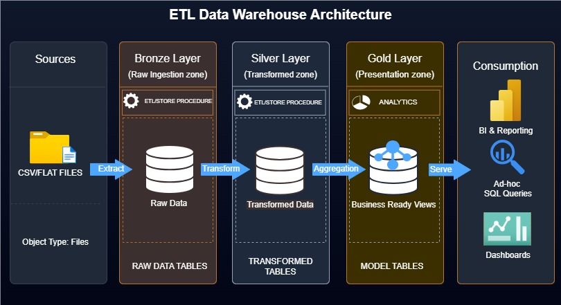

## SQL DATA WAREHOUSE AND ANALYTICS PROJECT

This project showcases an end-to-end data warehousing and analytics solution, covering everything from warehouse development to the creation of actionable insights.

#### Data Architecture
The project’s data architecture is based on the Medallion Architecture, consisting of Bronze, Silver, and Gold layers.

#### Project Overview
This project presents an end-to-end data warehousing and analytics solution designed to transform raw data into meaningful business insights. It follows the Medallion Architecture approach, using Bronze, Silver, and Gold layers to organize data from ingestion through transformation to reporting-ready models. The solution demonstrates key data engineering practices such as data loading, cleansing, standardization, and dimensional modeling, while also supporting analytics and decision-making through a structured star schema. It showcases practical skills in building scalable data pipelines and delivering business-ready data for reporting and analysis.

- **Bronze Layer**: Stores raw data as-is from the source systems. Data is ingested from CSV Files into SQL Server Database.
- **Silver Layer**: This layer includes data cleansing, standardization, and normalization processes to prepare data for analysis.
- **Gold Layer**: Houses business-ready data modeled into a star schema required for reporting and analytics.

