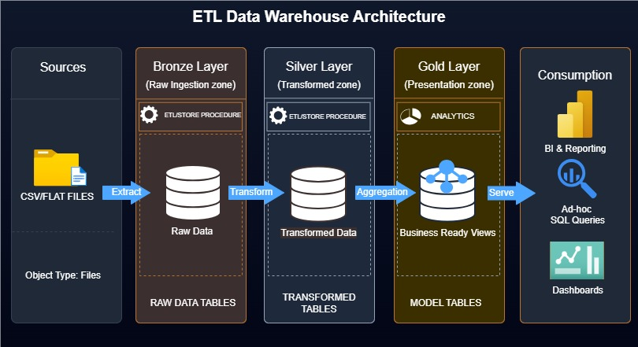

# SQL DATA WAREHOUSE AND ANALYTICS PROJECT

#### Project Overview
This project presents an end-to-end data warehousing and analytics solution designed to transform raw data into meaningful business insights. It follows the Medallion Architecture approach, using Bronze, Silver, and Gold layers to organize data from ingestion through transformation to reporting-ready models. The solution demonstrates key data engineering practices such as data loading, cleansing, standardization, and dimensional modeling, while also supporting analytics and decision-making through a structured star schema. It showcases practical skills in building scalable data pipelines and delivering business-ready data for reporting and analysis.

#### Data Architecture
The project’s data architecture is based on the Medallion Architecture, consisting of Bronze, Silver, and Gold layers.

### Project Highlights
- End-to-End SQL Server Data Warehouse
- Bronze → Silver → Gold Architecture
- Incremental Data Loading using MERGE
- Dimension & Fact Tables
- Stored Procedures
- Data Cleansing & Standardization
- Automated ETL Processing

### Technologies Used
- SQL Server
- SQL Server Management Studio (SSMS)
- GitHub
- VS Code

### Skills Demonstrated
- Data Warehousing
- ETL Development
- Incremental Data Loading
- Dimensional Modeling
- Star Schema Design
- Query Optimization
- Data Engineering

### Conclusion
This project highlights practical skills in SQL Server development, ETL design, data modeling, and warehouse architecture, providing a strong foundation for building enterprise-scale analytical solutions. It also demonstrates how well-structured data pipelines can transform raw operational data into valuable business insights that support informed decision-making.

